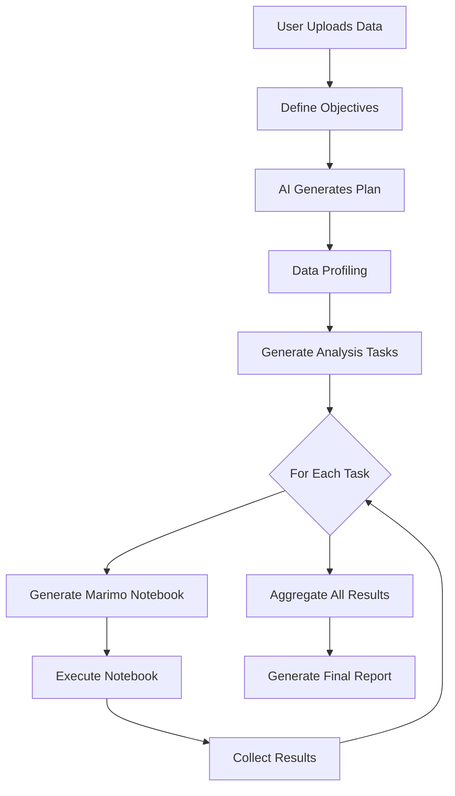

# 🚀 4-Step to Marimo Integration Documentation

## Overview

This document describes the complete integration between the 4-step consultative workflow and automated Marimo notebook execution, creating a seamless end-to-end data analysis platform.

## Architecture

```
┌─────────────────────────────────────────────────────────────┐
│                     User Interface (Streamlit)               │
├─────────────────────────────────────────────────────────────┤
│                      4-Step Workflow Layer                   │
│  ┌──────────┐ ┌──────────┐ ┌──────────┐ ┌──────────┐      │
│  │  Step 1  │→│  Step 2  │→│  Step 3  │→│  Step 4  │      │
│  │  Project │ │  Manager │ │   Data   │ │ Analysis │      │
│  │   Setup  │ │ Planning │ │ Profile  │ │ Guidance │      │
│  └──────────┘ └──────────┘ └──────────┘ └──────────┘      │
├─────────────────────────────────────────────────────────────┤
│                    Integration Layer                         │
│  ┌──────────────────────┐ ┌──────────────────────┐         │
│  │   Task Converter     │ │  Notebook Generator  │         │
│  └──────────────────────┘ └──────────────────────┘         │
├─────────────────────────────────────────────────────────────┤
│                   Marimo Execution Layer                     │
│  ┌──────────┐ ┌──────────┐ ┌──────────┐ ┌──────────┐      │
│  │Notebook 1│ │Notebook 2│ │Notebook 3│ │Notebook N│      │
│  └──────────┘ └──────────┘ └──────────┘ └──────────┘      │
├─────────────────────────────────────────────────────────────┤
│                   Results Aggregation                        │
└─────────────────────────────────────────────────────────────┘
```

## Components

### 1. 4-Step Workflow (`streamlit_app_4steps.py`)

The initial 4-step process that guides users through project setup:

- **Step 1: Project Setup** - Collects project metadata and data files
- **Step 2: Manager Planning** - AI-powered strategic planning
- **Step 3: Data Understanding** - Comprehensive data profiling
- **Step 4: Analysis Guidance** - Task decomposition and planning

### 2. Integrated Application (`streamlit_app_integrated.py`)

Enhanced version with Marimo integration:

- All 4 steps from the original workflow
- **Step 5: Marimo Execution** - Automated notebook execution
- Task-to-notebook mapping
- Real-time execution monitoring
- Results aggregation

### 3. Workflow Manager (`workflow_manager.py`)

Core orchestration component:

- Task management and assignment
- Marimo notebook generation for each task type
- Execution coordination
- Results aggregation

### 4. Marimo Integration (`marimo_integration/`)

- `NotebookBuilder` - Programmatic notebook creation
- `NotebookRunner` - Notebook execution engine
- Template generation for different analysis types

## Task Type Mapping

| Analysis Task | Task Type | Marimo Notebook | Key Features |
|--------------|-----------|-----------------|--------------|
| Exploratory Data Analysis | DATA_PROFILING | `eda_analysis.py` | Statistics, distributions, quality metrics |
| Statistical Analysis | STATISTICAL_ANALYSIS | `statistical_tests.py` | Hypothesis testing, significance analysis |
| Predictive Modeling | PREDICTIVE_MODELING | `predictive_model.py` | ML models, feature importance, predictions |
| Anomaly Detection | ANOMALY_DETECTION | `anomaly_detection.py` | Isolation Forest, statistical outliers |
| Customer Segmentation | SEGMENTATION | `customer_segments.py` | K-means clustering, segment profiles |
| Data Visualization | VISUALIZATION | `executive_dashboard.py` | Interactive charts, KPI dashboards |
| Time Series Analysis | TIME_SERIES_ANALYSIS | `timeseries_analysis.py` | Decomposition, trends, seasonality |
| Correlation Analysis | CORRELATION_ANALYSIS | `correlation_analysis.py` | Correlation matrices, relationships |

## Workflow Execution Flow



## Key Features

### 1. Automatic Task Generation
- Analyzes business objectives
- Maps objectives to appropriate analysis types
- Generates task list with priorities

### 2. Dynamic Notebook Generation
- Creates customized Marimo notebooks for each task
- Includes data loading, analysis code, and visualization
- Parameterized based on task requirements

### 3. Parallel Execution
- Supports sequential or parallel task execution
- Manages dependencies between tasks
- Real-time progress tracking

### 4. Results Aggregation
- Collects outputs from all notebooks
- Synthesizes key findings
- Generates executive summary

## Usage Instructions

### Running the Integrated Application

```bash
# Basic 4-step application
streamlit run streamlit_app_4steps.py

# Integrated with Marimo
streamlit run streamlit_app_integrated.py
```

### API Key Configuration

Add Gemini API key for AI features:
- Via Streamlit secrets: `.streamlit/secrets.toml`
- Via sidebar input in the application

### Sample Workflow

1. **Project Setup**
   - Enter project name and objectives
   - Upload CSV/Excel data files
   - Define success criteria

2. **Planning**
   - Click "Generate AI Analysis Plan"
   - Review and approve the plan

3. **Data Understanding**
   - Automatic data profiling
   - Quality assessment
   - Review statistics

4. **Task Generation**
   - Click "Generate Analysis Tasks"
   - Review task list and priorities

5. **Notebook Generation**
   - Click "Generate Notebook" for each task
   - Notebooks created in `workspace/notebooks/`

6. **Execution**
   - Click "Start Execution"
   - Monitor progress in real-time
   - View results as they complete

7. **Results**
   - Review aggregated findings
   - Download reports
   - Export notebooks

## Testing

### Unit Tests
```bash
# Test 4-step logic
python3 test_4steps_logic.py

# Test integrated workflow
python3 test_integrated_workflow.py
```

### Integration Tests
- Validates data flow between steps
- Tests notebook generation
- Verifies result aggregation

## File Structure

```
repo/
├── streamlit_app_4steps.py         # Original 4-step application
├── streamlit_app_integrated.py     # Integrated with Marimo
├── test_4steps_logic.py           # 4-step validation
├── test_integrated_workflow.py     # Integration testing
├── src/python/
│   ├── workflow/
│   │   └── workflow_manager.py    # Orchestration engine
│   └── marimo_integration/
│       ├── notebook_builder.py    # Notebook generation
│       └── notebook_runner.py     # Execution engine
└── integrated_workspace/
    ├── notebooks/                  # Generated Marimo notebooks
    ├── results/                    # Execution results
    └── temp_data/                  # Temporary data files
```

## Configuration

### Workspace Structure
```python
workspace_path = "./integrated_workspace"
├── plans/        # Analysis plans
├── tasks/        # Task definitions  
├── notebooks/    # Marimo notebooks
└── results/      # Execution results
```

### Task Priorities
- 5: Critical (immediate execution)
- 4: High (priority queue)
- 3: Medium (standard queue)
- 2: Low (batch processing)
- 1: Optional (as resources permit)

## Advanced Features

### Custom Task Types
Add new analysis types by:
1. Define TaskType enum value
2. Create notebook generation method
3. Map to UI task selection

### Result Processing
Results automatically processed for:
- Key metric extraction
- Anomaly highlighting
- Trend identification
- Recommendation generation

## Troubleshooting

### Common Issues

1. **Notebooks not generating**
   - Check workspace permissions
   - Verify data file paths
   - Ensure dependencies installed

2. **Execution failures**
   - Check Python environment
   - Verify Marimo installation
   - Review notebook syntax

3. **Results not aggregating**
   - Ensure notebooks return proper format
   - Check result file permissions
   - Verify aggregation logic

## Future Enhancements

- [ ] Real Marimo notebook execution (currently simulated)
- [ ] Database persistence for workflows
- [ ] Multi-user collaboration
- [ ] Advanced scheduling system
- [ ] Cloud deployment support
- [ ] Export to various formats (PDF, Excel, PowerBI)
- [ ] Integration with external data sources
- [ ] Custom ML model deployment

## Support

For issues or questions:
- Check test scripts for examples
- Review integration test output
- Examine generated notebooks in workspace

## License

This integration is part of the AI Data Analysis Platform project.

---

*Last Updated: September 2025*
*Version: 1.0.0*