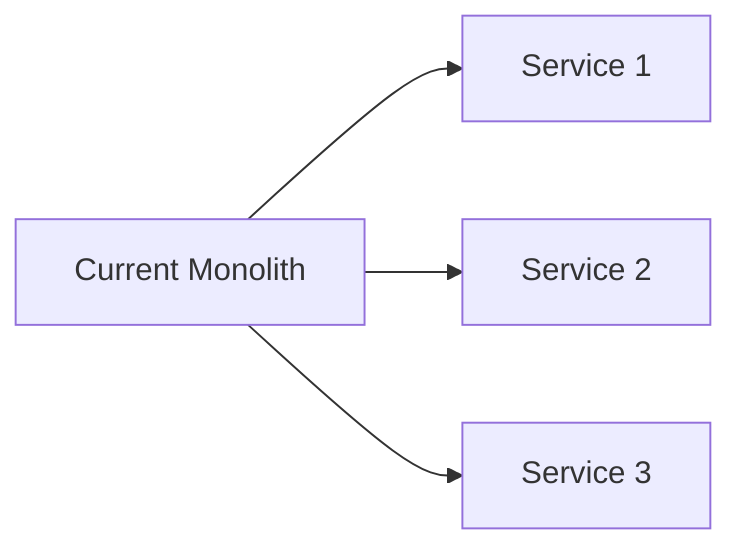

# 🎯 Prompt Engineering Guide for Claude Code
**Iterative Development with AI-Powered Implementation**

## Table of Contents
1. [Core Principles](#core-principles)
2. [Prompt Templates](#prompt-templates)
3. [Iterative Development Workflow](#iterative-development-workflow)
4. [Testing & Validation Strategies](#testing--validation-strategies)
5. [Common Patterns & Anti-Patterns](#common-patterns--anti-patterns)
6. [Recursive Implementation Guide](#recursive-implementation-guide)

## Core Principles

### 1. Clarity Over Brevity
```markdown
❌ Bad: "Add auth"
✅ Good: "Implement JWT authentication with refresh tokens, role-based access control, and session management. Include middleware for route protection and token validation."
```

### 2. Provide Context
```markdown
❌ Bad: "Fix the bug"
✅ Good: "The LangGraph orchestrator fails when confidence score is exactly 0.7 (the threshold). Fix the comparison logic in the routing function to handle edge cases. Current code uses < but should use <=."
```

### 3. Specify Success Criteria
```markdown
❌ Bad: "Make it faster"
✅ Good: "Optimize the data processing pipeline to handle 1M rows in <5 seconds. Current performance is 12 seconds. Focus on vectorization and caching. Measure with included benchmark script."
```

## Prompt Templates

### 🔧 Template 1: Feature Implementation

```markdown
# Context
- Project: AI Data Analysis Platform with HITL
- Current State: [Describe current implementation]
- Dependencies: LangGraph, Marimo, Playwright
- Architecture: [Reference specific components]

# Objective
Implement [specific feature] that [does what] for [which users/components]

# Requirements
Functional:
- [ ] Requirement 1 with specific acceptance criteria
- [ ] Requirement 2 with measurable outcome
- [ ] Requirement 3 with edge cases handled

Non-Functional:
- Performance: <2s response time for 95th percentile
- Scalability: Support 100 concurrent users
- Security: Input validation and sanitization
- Accessibility: WCAG 2.1 AA compliance

# Implementation Details
- Use existing pattern from [reference file]
- Follow project conventions (see CLAUDE.md)
- Integrate with [existing components]
- Maintain backwards compatibility

# Testing Requirements
1. Unit tests with >80% coverage
2. Integration tests for API endpoints
3. Visual regression tests with Playwright
4. Performance benchmarks
5. Include test data factory

# Deliverables
1. Implementation code in [specific file(s)]
2. Test suite in test_[feature].py
3. Screenshots in screenshots/[feature]/
4. Documentation updates in relevant .md files
5. Example usage in examples/

# Success Criteria
- [ ] All tests passing (show test output)
- [ ] Visual regression <5% (include screenshots)
- [ ] Performance targets met (show metrics)
- [ ] Code review checklist complete
- [ ] Documentation updated
```

### 🐛 Template 2: Bug Fix

```markdown
# Bug Report
- Issue: [Specific problem description]
- Location: [File:line number]
- Severity: Critical/High/Medium/Low
- Affects: [Which features/users]

# Steps to Reproduce
1. [Step 1 with exact commands]
2. [Step 2 with expected vs actual]
3. [Step 3 with error message]

# Current Behavior
```python
# Paste problematic code
def buggy_function():
    return wrong_value  # This returns X but should return Y
```

# Expected Behavior
```python
# Show correct implementation
def fixed_function():
    return correct_value  # Returns Y as expected
```

# Root Cause Analysis
[Explain why the bug occurs]

# Fix Requirements
- Maintain existing API contract
- Handle edge cases: [list them]
- Add regression tests
- Update affected documentation

# Validation
1. Run existing test suite
2. Add specific test for this bug
3. Verify in integration environment
4. Check performance impact
```

### 🔄 Template 3: Refactoring

```markdown
# Refactoring Objective
Transform [current implementation] to [target architecture] to achieve [specific benefits]

# Current Problems
1. [Problem 1: e.g., tight coupling]
2. [Problem 2: e.g., poor performance]
3. [Problem 3: e.g., difficult to test]

# Proposed Solution


# Refactoring Steps
1. [ ] Extract interface definitions
2. [ ] Create abstraction layer
3. [ ] Migrate functionality incrementally
4. [ ] Update tests for new structure
5. [ ] Update documentation

# Constraints
- Zero downtime during migration
- Maintain backwards compatibility
- No breaking changes to API
- Preserve all existing functionality

# Success Metrics
- Code complexity reduced by 30%
- Test execution time reduced by 50%
- Improved modularity (measurable)
- Easier onboarding (documented)
```

### 🧪 Template 4: Test Creation

```markdown
# Test Suite Requirements
Component: [What we're testing]
Type: Unit/Integration/E2E/Visual/Performance

# Test Scenarios
1. Happy Path
   - Input: [Valid data]
   - Expected: [Success response]
   - Validation: [Specific assertions]

2. Edge Cases
   - Empty input
   - Maximum values
   - Minimum values
   - Boundary conditions

3. Error Cases
   - Invalid input
   - Missing required fields
   - Unauthorized access
   - System failures

4. Performance
   - Load: 1000 requests/second
   - Response time: <100ms p95
   - Memory usage: <500MB
   - CPU usage: <70%

# Test Data Requirements
```python
# Provide test data factory
class TestDataFactory:
    @staticmethod
    def create_valid_user():
        return {...}
    
    @staticmethod
    def create_invalid_user():
        return {...}
```

# Visual Testing
- Capture screenshots for all states
- Compare against baselines
- Flag regressions >5%
- Document visual changes

# Coverage Requirements
- Line coverage: >80%
- Branch coverage: >70%
- Critical paths: 100%
```

## Iterative Development Workflow

### Round 1: Initial Implementation (Breadth)

```markdown
Create a working prototype of [feature] with:
1. Basic functionality (happy path only)
2. Minimal error handling
3. Simple tests
4. Basic documentation

Focus on structure and integration points.
Don't optimize yet.
```

### Round 2: Robustness (Depth)

```markdown
Enhance the prototype with:
1. Comprehensive error handling
2. Edge case management
3. Input validation
4. Logging and monitoring
5. Full test coverage

Make it production-ready.
```

### Round 3: Optimization (Performance)

```markdown
Optimize the implementation:
1. Profile and identify bottlenecks
2. Implement caching where appropriate
3. Optimize database queries
4. Reduce memory footprint
5. Improve response times

Include before/after metrics.
```

### Round 4: Polish (User Experience)

```markdown
Refine the user experience:
1. Improve error messages
2. Add helpful tooltips
3. Enhance visual feedback
4. Optimize loading states
5. Add accessibility features

Focus on delight and usability.
```

## Testing & Validation Strategies

### 1. Screenshot-Driven Development

```markdown
For every UI change:
1. Capture "before" screenshot
2. Make the change
3. Capture "after" screenshot
4. Generate diff visualization
5. Document in PR

This ensures visual consistency and catches unexpected changes.
```

### 2. Test-First Implementation

```markdown
Write the test that describes desired behavior:

```python
def test_human_approval_workflow():
    # Given: Task with low confidence
    task = create_task(confidence=0.5)
    
    # When: Workflow executes
    result = orchestrator.execute(task)
    
    # Then: Human review is triggered
    assert result.status == "awaiting_human_review"
    assert result.review_priority == "high"
```

Then implement to make the test pass.
```

### 3. Incremental Validation

```markdown
After each code change:
1. Run affected unit tests (fast feedback)
2. Run integration tests (system health)
3. Run visual tests (UI consistency)
4. Check performance metrics (no regression)
5. Review code coverage (maintained/improved)

Stop and fix if any step fails.
```

## Common Patterns & Anti-Patterns

### ✅ Effective Patterns

#### Pattern: Specific Context
```markdown
"In the LangGraph orchestrator (orchestrator.py), update the human_review_node 
function to support parallel reviews by multiple reviewers. Current implementation 
at line 234 only handles single reviewer. Use asyncio.gather for parallel execution."
```

#### Pattern: Incremental Progress
```markdown
"Add WebSocket support to the orchestrator:
Step 1: Add WebSocket endpoint
Step 2: Implement connection manager
Step 3: Add real-time updates
Step 4: Test with multiple clients
Show working code after each step."
```

#### Pattern: Example-Driven
```markdown
"Implement retry logic similar to how it's done in backend/api_client.py:
- Exponential backoff
- Max 3 retries
- Circuit breaker pattern
- Log all attempts
Match the existing code style."
```

### ❌ Anti-Patterns to Avoid

#### Anti-Pattern: Vague Instructions
```markdown
❌ "Make it better"
❌ "Fix all the issues"
❌ "Optimize everything"
```

#### Anti-Pattern: No Success Criteria
```markdown
❌ "Add caching" (Where? What to cache? TTL? Size limits?)
❌ "Improve performance" (Current? Target? Metrics?)
```

#### Anti-Pattern: Missing Context
```markdown
❌ "Add the feature we discussed" (What feature? What discussion?)
❌ "Use the usual pattern" (Which pattern? From where?)
```

## Recursive Implementation Guide

### Session Structure

```markdown
# ============================================
# SESSION: [Date] - [Feature/Task Name]
# ============================================

## 🎯 Objective
[Clear, single objective for this session]

## 📋 Pre-Session Checklist
- [ ] Review CLAUDE.md for context
- [ ] Check TODO list status
- [ ] Run test suite (baseline)
- [ ] Review previous session notes

## 🔨 Implementation Plan
1. [First deliverable - 30 min]
2. [Second deliverable - 30 min]
3. [Third deliverable - 30 min]
4. [Testing & validation - 30 min]

## 💻 Implementation

### Step 1: [Task Name]
```
[Prompt for Claude Code]
```

**Validation:**
- [ ] Tests pass
- [ ] Screenshots captured
- [ ] Performance checked

### Step 2: [Task Name]
```
[Prompt for Claude Code]
```

**Validation:**
- [ ] Tests pass
- [ ] Screenshots captured
- [ ] Performance checked

## ✅ Session Outcomes
- Completed: [What was done]
- Pending: [What remains]
- Blockers: [Any issues]
- Learnings: [Key insights]

## 📝 Next Session Plan
[What to do next time]

## 🔄 CLAUDE.md Updates
[What to add to CLAUDE.md]
```

### Prompt Chaining Strategy

#### Chain 1: Setup → Implementation → Test
```markdown
Prompt 1: "Set up the project structure for [feature]"
↓
Prompt 2: "Implement the core logic based on the structure"
↓
Prompt 3: "Add comprehensive tests for the implementation"
↓
Prompt 4: "Capture screenshots and validate visually"
```

#### Chain 2: Debug → Fix → Verify
```markdown
Prompt 1: "Analyze why [test] is failing. Show the error trace."
↓
Prompt 2: "Fix the identified issue without breaking other tests"
↓
Prompt 3: "Add regression test for this specific bug"
↓
Prompt 4: "Verify all tests still pass"
```

#### Chain 3: Refactor → Optimize → Document
```markdown
Prompt 1: "Refactor [component] to use [pattern]"
↓
Prompt 2: "Optimize the refactored code for performance"
↓
Prompt 3: "Update documentation and add examples"
↓
Prompt 4: "Create migration guide for the changes"
```

### Validation Checkpoints

After each prompt, validate with:

```markdown
## Checkpoint Validation

### 1. Functional Check
```bash
python test_[feature].py
```
Expected: All tests pass ✅

### 2. Visual Check
```bash
playwright test tests/visual/[feature]
```
Expected: <5% difference ✅

### 3. Performance Check
```bash
python benchmark_[feature].py
```
Expected: <2s response time ✅

### 4. Code Quality Check
```bash
black . && isort . && mypy .
```
Expected: No errors ✅

### 5. Documentation Check
- [ ] Docstrings updated
- [ ] README updated
- [ ] CLAUDE.md updated
- [ ] Examples provided
```

## Quick Reference Card

### Most Effective Prompts

1. **"Create X with tests and screenshots"**
   - Always gets implementation + validation

2. **"Fix X, showing before/after comparison"**
   - Ensures understanding of the change

3. **"Implement X following pattern in Y"**
   - Maintains consistency

4. **"Add X without breaking existing Y"**
   - Preserves functionality

5. **"Optimize X to achieve Y metric"**
   - Measurable improvement

### Session Productivity Tips

1. **Start with the hardest task** - Mental energy is highest
2. **Batch similar tasks** - Context switching is expensive
3. **Test frequently** - Catch issues early
4. **Document immediately** - Memory fades quickly
5. **Commit often** - Preserve working states

### Emergency Protocols

When things go wrong:

```markdown
## 🚨 Emergency Recovery

1. **Test Suite Broken**
   ```bash
   git stash
   git checkout main
   python -m pytest tests/ -v
   ```

2. **Visual Regression**
   ```bash
   playwright test --update-snapshots
   git diff screenshots/
   ```

3. **Performance Degradation**
   ```bash
   git bisect start
   git bisect bad HEAD
   git bisect good [last-known-good]
   ```

4. **Deployment Failed**
   ```bash
   ./scripts/rollback.sh
   ./scripts/smoke-test.sh
   ```

5. **Data Corruption**
   ```bash
   ./scripts/restore-db.sh [backup-id]
   ./scripts/verify-integrity.sh
   ```
```

## Measuring Success

### Metrics to Track

```markdown
Per Session:
- Lines of code written: ___
- Tests written: ___
- Tests passing: ___/%
- Screenshots captured: ___
- Documentation updated: Yes/No
- Performance impact: +/- ___ ms
- Visual regression: ___/%

Per Week:
- Features completed: ___
- Bugs fixed: ___
- Test coverage: ___/%
- Performance improvement: ___/%
- Documentation coverage: ___/%
```

### Success Indicators

🟢 **Green Flags:**
- All tests passing
- Performance improved
- Documentation complete
- No visual regression
- Code review passed

🟡 **Yellow Flags:**
- Some tests failing
- Performance unchanged
- Documentation partial
- Minor visual changes
- Code review has comments

🔴 **Red Flags:**
- Many tests failing
- Performance degraded
- No documentation
- Major visual breaks
- Code review rejected

---

**Remember**: The goal is not just to write code, but to build a maintainable, testable, and documented system. Each prompt should move us closer to production readiness.