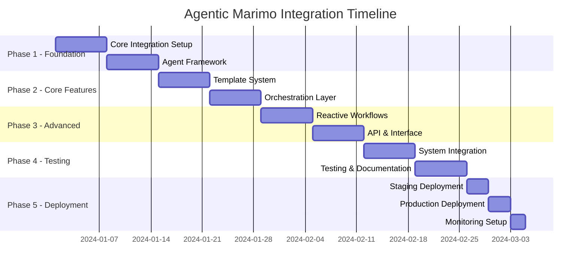

# Marimo Integration Plan: Building an Agentic Data Analysis Platform

## Executive Summary

This document outlines the comprehensive plan to integrate Marimo's reactive notebook capabilities into the AI Data Analysis Team repository, creating an "Agentic Marimo" system that combines autonomous AI agents with reactive computational notebooks for advanced data analysis workflows.

## Table of Contents

1. [Vision & Objectives](#vision--objectives)
2. [Architecture Overview](#architecture-overview)
3. [User Workflows](#user-workflows)
4. [Technical Architecture](#technical-architecture)
5. [Implementation Plan](#implementation-plan)
6. [Integration Components](#integration-components)
7. [Data Flow Design](#data-flow-design)
8. [API Specifications](#api-specifications)
9. [Deployment Strategy](#deployment-strategy)
10. [Testing & Validation](#testing--validation)
11. [Timeline & Milestones](#timeline--milestones)

---

## Vision & Objectives

### Primary Goal
Transform the repository into an intelligent data analysis platform where AI agents autonomously orchestrate Marimo notebooks to perform complex analytical tasks, creating a seamless bridge between human intent and computational execution.

### Key Objectives
1. **Autonomous Execution**: Enable AI agents to create, modify, and execute Marimo notebooks
2. **Reactive Workflows**: Leverage Marimo's reactive programming model for real-time data analysis
3. **Intelligent Orchestration**: Implement agent-based decision making for analysis pipelines
4. **Collaborative Analysis**: Support multi-agent collaboration on complex analytical tasks
5. **Reproducible Research**: Maintain git-friendly, reproducible analysis workflows

---

## Architecture Overview

### High-Level Architecture

```
┌─────────────────────────────────────────────────────────────┐
│                      User Interface Layer                    │
│  ┌──────────────┐  ┌──────────────┐  ┌──────────────┐     │
│  │   Web UI     │  │   CLI Tool   │  │   API Client │     │
│  └──────────────┘  └──────────────┘  └──────────────┘     │
└─────────────────────────────────────────────────────────────┘
                               │
┌─────────────────────────────────────────────────────────────┐
│                    Agent Orchestration Layer                 │
│  ┌──────────────────────────────────────────────────────┐  │
│  │         Agent Manager & Task Distribution            │  │
│  └──────────────────────────────────────────────────────┘  │
│  ┌─────────┐  ┌─────────┐  ┌─────────┐  ┌─────────┐      │
│  │Analysis │  │  Data   │  │   ML    │  │Reporting│      │
│  │  Agent  │  │  Agent  │  │  Agent  │  │  Agent  │      │
│  └─────────┘  └─────────┘  └─────────┘  └─────────┘      │
└─────────────────────────────────────────────────────────────┘
                               │
┌─────────────────────────────────────────────────────────────┐
│                    Marimo Integration Layer                  │
│  ┌──────────────────────────────────────────────────────┐  │
│  │          Marimo Runtime & Notebook Manager           │  │
│  └──────────────────────────────────────────────────────┘  │
│  ┌──────────────┐  ┌──────────────┐  ┌──────────────┐     │
│  │   Notebook   │  │   Reactive   │  │   Template   │     │
│  │   Executor   │  │   Engine     │  │   Library    │     │
│  └──────────────┘  └──────────────┘  └──────────────┘     │
└─────────────────────────────────────────────────────────────┘
                               │
┌─────────────────────────────────────────────────────────────┐
│                      Data & Storage Layer                    │
│  ┌──────────────┐  ┌──────────────┐  ┌──────────────┐     │
│  │   Database   │  │  File Store  │  │  Model Store │     │
│  └──────────────┘  └──────────────┘  └──────────────┘     │
└─────────────────────────────────────────────────────────────┘
```

---

## User Workflows

### Workflow 1: Natural Language to Analysis
```
User Input: "Analyze sales trends for Q4 and predict Q1"
    ↓
Agent Interpretation
    ↓
Notebook Generation (Marimo)
    ↓
Data Loading & Processing
    ↓
Analysis Execution
    ↓
Visualization & Reporting
    ↓
User Review & Iteration
```

### Workflow 2: Automated Data Pipeline
```
Data Source Changes
    ↓
Trigger Agent
    ↓
Load Marimo Template
    ↓
Execute Transformations
    ↓
Quality Checks
    ↓
Update Dashboard
    ↓
Alert Stakeholders
```

### Workflow 3: Collaborative Analysis
```
Multiple Users → Task Decomposition
    ↓
Agent Assignment
    ↓
Parallel Notebook Execution
    ↓
Result Aggregation
    ↓
Consensus Building
    ↓
Final Report Generation
```

---

## Technical Architecture

### Component Structure

```
ai-data-analysis-team/
├── src/
│   ├── agents/                    # AI Agent implementations
│   │   ├── base_agent.py          # Base agent class
│   │   ├── analysis_agent.py      # Data analysis specialist
│   │   ├── ml_agent.py            # Machine learning specialist
│   │   ├── data_agent.py          # Data processing specialist
│   │   └── orchestrator.py        # Multi-agent orchestrator
│   │
│   ├── marimo_integration/        # Marimo integration layer
│   │   ├── notebook_manager.py    # Notebook lifecycle management
│   │   ├── runtime_bridge.py      # Marimo runtime interface
│   │   ├── template_engine.py     # Dynamic notebook generation
│   │   ├── reactive_executor.py   # Reactive execution handler
│   │   └── state_manager.py       # Notebook state persistence
│   │
│   ├── api/                       # API layer
│   │   ├── rest_api.py           # RESTful endpoints
│   │   ├── websocket_api.py      # Real-time communication
│   │   ├── graphql_api.py        # GraphQL interface
│   │   └── authentication.py      # Auth & authorization
│   │
│   ├── core/                      # Core utilities
│   │   ├── task_queue.py         # Task management
│   │   ├── event_bus.py          # Event-driven architecture
│   │   ├── cache_manager.py      # Caching layer
│   │   └── config_loader.py      # Configuration management
│   │
│   └── ui/                        # User interface
│       ├── web_app/               # Web application
│       ├── cli/                   # Command-line interface
│       └── components/            # Shared UI components
│
├── marimo_notebooks/              # Marimo notebook storage
│   ├── templates/                 # Reusable notebook templates
│   ├── generated/                 # Agent-generated notebooks
│   └── user_notebooks/            # User-created notebooks
│
├── agents_config/                 # Agent configurations
│   ├── agent_profiles.yaml        # Agent capabilities & roles
│   ├── task_mappings.yaml        # Task-to-agent mappings
│   └── collaboration_rules.yaml  # Multi-agent collaboration rules
│
└── integration_tests/             # Integration test suites
```

### Key Integration Components

#### 1. Agent-Marimo Bridge (`marimo_integration/runtime_bridge.py`)
```python
class MarimoRuntimeBridge:
    """Bridges AI agents with Marimo runtime"""
    
    def __init__(self):
        self.marimo_server = None
        self.active_notebooks = {}
        self.execution_queue = Queue()
    
    async def create_notebook(self, agent_id: str, template: str = None):
        """Create new Marimo notebook for agent"""
        pass
    
    async def execute_cell(self, notebook_id: str, code: str):
        """Execute code cell in notebook"""
        pass
    
    async def get_notebook_state(self, notebook_id: str):
        """Get current notebook state and variables"""
        pass
    
    async def reactive_update(self, notebook_id: str, variable: str, value: Any):
        """Trigger reactive update in notebook"""
        pass
```

#### 2. Agent Orchestrator (`agents/orchestrator.py`)
```python
class AgentOrchestrator:
    """Orchestrates multiple agents for complex tasks"""
    
    def __init__(self):
        self.agents = {}
        self.task_queue = TaskQueue()
        self.marimo_bridge = MarimoRuntimeBridge()
    
    async def process_request(self, user_request: str):
        """Process user request and coordinate agents"""
        # 1. Parse and understand request
        # 2. Decompose into subtasks
        # 3. Assign to appropriate agents
        # 4. Monitor execution
        # 5. Aggregate results
        pass
    
    async def coordinate_agents(self, task_plan: Dict):
        """Coordinate multiple agents for task execution"""
        pass
```

#### 3. Template Engine (`marimo_integration/template_engine.py`)
```python
class MarimoTemplateEngine:
    """Generate Marimo notebooks from templates"""
    
    def __init__(self):
        self.template_library = {}
        self.variable_registry = {}
    
    def generate_notebook(self, 
                         template_name: str, 
                         context: Dict,
                         agent_modifications: List[Dict] = None):
        """Generate Marimo notebook from template with agent modifications"""
        pass
    
    def create_reactive_pipeline(self, 
                                pipeline_spec: Dict):
        """Create reactive data pipeline notebook"""
        pass
```

---

## Implementation Plan

### Phase 1: Foundation (Weeks 1-2)

#### Week 1: Core Integration Setup
```yaml
Tasks:
  - Install and configure Marimo as dependency
  - Set up Marimo server integration
  - Create basic runtime bridge
  - Implement notebook lifecycle management
  
Deliverables:
  - Working Marimo installation
  - Basic notebook creation/execution API
  - Unit tests for core components
```

#### Week 2: Agent Framework
```yaml
Tasks:
  - Implement base agent class
  - Create specialized agent types
  - Develop agent-notebook communication
  - Set up agent configuration system

Deliverables:
  - Agent framework implementation
  - Agent-Marimo bridge functionality
  - Agent configuration files
```

### Phase 2: Core Features (Weeks 3-4)

#### Week 3: Template System
```yaml
Tasks:
  - Create notebook template library
  - Implement template engine
  - Develop dynamic notebook generation
  - Build template validation system

Deliverables:
  - Template library with 10+ templates
  - Template engine with variable substitution
  - Template testing suite
```

#### Week 4: Orchestration Layer
```yaml
Tasks:
  - Implement task decomposition logic
  - Create multi-agent coordination
  - Develop execution monitoring
  - Build result aggregation system

Deliverables:
  - Working orchestrator
  - Task distribution system
  - Execution monitoring dashboard
```

### Phase 3: Advanced Features (Weeks 5-6)

#### Week 5: Reactive Workflows
```yaml
Tasks:
  - Implement reactive data pipelines
  - Create event-driven execution
  - Develop state synchronization
  - Build dependency tracking

Deliverables:
  - Reactive pipeline system
  - Event bus implementation
  - State management system
```

#### Week 6: API & Interface
```yaml
Tasks:
  - Develop REST API endpoints
  - Implement WebSocket communication
  - Create CLI tools
  - Build basic web UI

Deliverables:
  - Complete API documentation
  - Working CLI interface
  - Basic web dashboard
```

### Phase 4: Integration & Testing (Weeks 7-8)

#### Week 7: System Integration
```yaml
Tasks:
  - Integrate all components
  - Implement end-to-end workflows
  - Create deployment scripts
  - Set up monitoring

Deliverables:
  - Fully integrated system
  - Deployment automation
  - Monitoring dashboard
```

#### Week 8: Testing & Documentation
```yaml
Tasks:
  - Comprehensive testing
  - Performance optimization
  - Documentation completion
  - User guide creation

Deliverables:
  - Test coverage > 80%
  - Performance benchmarks
  - Complete documentation
  - User tutorials
```

---

## Integration Components

### 1. Marimo Notebook Templates

#### Data Analysis Template
```python
# marimo_notebooks/templates/data_analysis.py
import marimo as mo
import pandas as pd
import numpy as np
from typing import Any, Dict

# Agent-injected parameters
_agent_params = mo.state({
    "data_source": None,
    "analysis_type": None,
    "output_format": None
})

# Data loading cell
@mo.cell
def load_data():
    data_source = _agent_params.value["data_source"]
    if data_source.endswith('.csv'):
        df = pd.read_csv(data_source)
    elif data_source.endswith('.parquet'):
        df = pd.read_parquet(data_source)
    else:
        df = pd.DataFrame()
    return df

# Analysis cell (agent-modifiable)
@mo.cell
def perform_analysis(df):
    analysis_type = _agent_params.value["analysis_type"]
    # Agent injects analysis code here
    results = {}
    return results

# Visualization cell
@mo.cell
def create_visualizations(results):
    # Agent generates visualization code
    pass
```

#### ML Pipeline Template
```python
# marimo_notebooks/templates/ml_pipeline.py
import marimo as mo
from sklearn.model_selection import train_test_split
from sklearn.metrics import classification_report

# Agent-controlled pipeline configuration
pipeline_config = mo.ui.dictionary({
    "model_type": mo.ui.dropdown(["rf", "xgb", "nn"]),
    "hyperparameters": mo.ui.dictionary({}),
    "validation_strategy": mo.ui.dropdown(["holdout", "cv"])
})

@mo.cell
def prepare_data():
    # Agent injects data preparation logic
    pass

@mo.cell
def train_model(X_train, y_train, config):
    # Agent injects model training logic
    pass

@mo.cell
def evaluate_model(model, X_test, y_test):
    # Agent injects evaluation logic
    pass
```

### 2. Agent Implementations

#### Analysis Agent
```python
# src/agents/analysis_agent.py
from typing import Dict, Any, List
import json

class AnalysisAgent:
    """Specializes in data analysis tasks"""
    
    def __init__(self, marimo_bridge):
        self.marimo_bridge = marimo_bridge
        self.capabilities = {
            "statistical_analysis": True,
            "time_series": True,
            "correlation_analysis": True,
            "anomaly_detection": True
        }
    
    async def analyze_request(self, request: str) -> Dict:
        """Analyze user request and plan execution"""
        # Use LLM to understand request
        plan = await self._generate_analysis_plan(request)
        return plan
    
    async def execute_analysis(self, plan: Dict) -> Any:
        """Execute analysis plan using Marimo notebook"""
        # 1. Select appropriate template
        template = self._select_template(plan["analysis_type"])
        
        # 2. Create notebook with parameters
        notebook_id = await self.marimo_bridge.create_notebook(
            agent_id=self.agent_id,
            template=template
        )
        
        # 3. Inject analysis code
        analysis_code = self._generate_analysis_code(plan)
        await self.marimo_bridge.execute_cell(notebook_id, analysis_code)
        
        # 4. Get results
        results = await self.marimo_bridge.get_notebook_state(notebook_id)
        
        return results
    
    def _generate_analysis_code(self, plan: Dict) -> str:
        """Generate Python code for analysis"""
        # Use code generation model or templates
        pass
```

#### ML Agent
```python
# src/agents/ml_agent.py
class MLAgent:
    """Specializes in machine learning tasks"""
    
    def __init__(self, marimo_bridge):
        self.marimo_bridge = marimo_bridge
        self.model_registry = {}
        
    async def train_model(self, 
                         data_path: str, 
                         task_type: str,
                         requirements: Dict) -> str:
        """Train ML model using Marimo notebook"""
        
        # 1. Create ML pipeline notebook
        notebook_id = await self.marimo_bridge.create_notebook(
            agent_id=self.agent_id,
            template="ml_pipeline"
        )
        
        # 2. Configure pipeline
        pipeline_config = self._configure_pipeline(task_type, requirements)
        
        # 3. Execute training pipeline
        await self._execute_training_pipeline(notebook_id, pipeline_config)
        
        # 4. Register trained model
        model_id = await self._register_model(notebook_id)
        
        return model_id
```

### 3. API Endpoints

#### REST API Specification
```python
# src/api/rest_api.py
from fastapi import FastAPI, BackgroundTasks
from pydantic import BaseModel

app = FastAPI()

class AnalysisRequest(BaseModel):
    query: str
    data_source: str
    output_format: str = "json"
    async_execution: bool = False

class AnalysisResponse(BaseModel):
    task_id: str
    status: str
    results: Dict = None
    notebook_url: str = None

@app.post("/api/v1/analyze")
async def create_analysis(
    request: AnalysisRequest,
    background_tasks: BackgroundTasks
):
    """Create new analysis task"""
    task_id = generate_task_id()
    
    if request.async_execution:
        background_tasks.add_task(
            execute_analysis_async,
            task_id,
            request
        )
        return AnalysisResponse(
            task_id=task_id,
            status="queued"
        )
    else:
        results = await execute_analysis(request)
        return AnalysisResponse(
            task_id=task_id,
            status="completed",
            results=results
        )

@app.get("/api/v1/tasks/{task_id}")
async def get_task_status(task_id: str):
    """Get task execution status"""
    pass

@app.ws("/api/v1/notebook/{notebook_id}/stream")
async def notebook_stream(websocket: WebSocket, notebook_id: str):
    """WebSocket endpoint for real-time notebook updates"""
    pass
```

---

## Data Flow Design

### Data Flow Architecture

```
1. Input Layer
   ├── User Query (Natural Language)
   ├── Structured API Request
   ├── File Upload
   └── Database Connection

2. Processing Layer
   ├── Query Understanding (NLP)
   ├── Task Decomposition
   ├── Agent Assignment
   └── Execution Planning

3. Execution Layer
   ├── Marimo Notebook Creation
   ├── Code Generation/Injection
   ├── Reactive Execution
   └── Result Collection

4. Output Layer
   ├── JSON Response
   ├── Interactive Dashboard
   ├── Report Generation
   └── Data Export
```

### Data Pipeline Example

```python
# Example: End-to-end data analysis pipeline

async def analyze_sales_data(user_query: str):
    # 1. Parse user intent
    intent = await nlp_service.parse_intent(user_query)
    # Output: {"type": "sales_analysis", "period": "Q4", "metrics": ["revenue", "growth"]}
    
    # 2. Create execution plan
    plan = await orchestrator.create_plan(intent)
    # Output: {"agents": ["data_agent", "analysis_agent"], "tasks": [...]}
    
    # 3. Execute with agents
    for task in plan["tasks"]:
        agent = get_agent(task["agent_type"])
        
        # Create Marimo notebook
        notebook = await agent.create_notebook(task["template"])
        
        # Execute analysis
        results = await agent.execute(notebook, task["parameters"])
        
        # Store intermediate results
        await store_results(task["id"], results)
    
    # 4. Aggregate results
    final_results = await orchestrator.aggregate_results(plan["task_ids"])
    
    # 5. Generate output
    report = await report_generator.create_report(final_results)
    
    return report
```

---

## API Specifications

### Core API Endpoints

#### 1. Analysis Management
```yaml
POST /api/v1/analyze:
  description: Create new analysis task
  request:
    query: string
    data_source: string | object
    agents: array[string] (optional)
    notebook_template: string (optional)
  response:
    task_id: string
    estimated_time: integer
    notebook_url: string

GET /api/v1/tasks/{task_id}:
  description: Get task status and results
  response:
    status: enum[pending, running, completed, failed]
    progress: integer (0-100)
    results: object (if completed)
    error: string (if failed)

DELETE /api/v1/tasks/{task_id}:
  description: Cancel running task
```

#### 2. Notebook Management
```yaml
GET /api/v1/notebooks:
  description: List all notebooks
  response:
    notebooks: array[NotebookInfo]

POST /api/v1/notebooks:
  description: Create new notebook
  request:
    template: string
    parameters: object
  response:
    notebook_id: string
    url: string

GET /api/v1/notebooks/{notebook_id}:
  description: Get notebook details
  response:
    id: string
    status: string
    cells: array[Cell]
    variables: object

PUT /api/v1/notebooks/{notebook_id}/execute:
  description: Execute notebook or specific cell
  request:
    cell_id: string (optional)
    code: string (optional)
```

#### 3. Agent Management
```yaml
GET /api/v1/agents:
  description: List available agents
  response:
    agents: array[AgentInfo]

POST /api/v1/agents/{agent_id}/invoke:
  description: Invoke agent for task
  request:
    task: object
    notebook_id: string (optional)
  response:
    result: object
    notebook_updates: array[Update]
```

### WebSocket Events

```javascript
// WebSocket connection for real-time updates
ws://localhost:8000/ws

// Client -> Server Events
{
  "type": "subscribe",
  "notebook_id": "nb_123",
  "events": ["cell_execution", "variable_update", "error"]
}

// Server -> Client Events
{
  "type": "cell_executed",
  "notebook_id": "nb_123",
  "cell_id": "cell_456",
  "output": {...}
}

{
  "type": "variable_updated",
  "notebook_id": "nb_123",
  "variable": "df",
  "shape": [1000, 5],
  "preview": {...}
}
```

---

## Deployment Strategy

### Deployment Architecture

```yaml
Production Environment:
  Application Layer:
    - Load Balancer (nginx/traefik)
    - API Servers (3+ instances)
    - WebSocket Servers (2+ instances)
    
  Processing Layer:
    - Agent Workers (auto-scaling)
    - Marimo Runtime Servers (containerized)
    - Task Queue (Redis/RabbitMQ)
    
  Data Layer:
    - PostgreSQL (primary database)
    - Redis (caching & sessions)
    - S3/MinIO (notebook & data storage)
    
  Monitoring:
    - Prometheus (metrics)
    - Grafana (dashboards)
    - ELK Stack (logging)
```

### Docker Compose Configuration

```yaml
# docker-compose.yml
version: '3.8'

services:
  api:
    build: ./src
    ports:
      - "8000:8000"
    environment:
      - DATABASE_URL=postgresql://...
      - REDIS_URL=redis://redis:6379
      - MARIMO_SERVER_URL=http://marimo:8080
    depends_on:
      - postgres
      - redis
      - marimo

  marimo:
    image: marimo:latest
    ports:
      - "8080:8080"
    volumes:
      - ./marimo_notebooks:/notebooks
      - ./data:/data
    environment:
      - MARIMO_MODE=server
      - MARIMO_ALLOW_REMOTE=true

  agent-worker:
    build: ./src
    command: python -m agents.worker
    scale: 3
    environment:
      - WORKER_TYPE=agent
      - REDIS_URL=redis://redis:6379
    depends_on:
      - redis
      - marimo

  postgres:
    image: postgres:14
    volumes:
      - postgres_data:/var/lib/postgresql/data
    environment:
      - POSTGRES_DB=agentic_marimo
      - POSTGRES_USER=admin
      - POSTGRES_PASSWORD=secure_password

  redis:
    image: redis:7
    volumes:
      - redis_data:/data

  nginx:
    image: nginx:alpine
    ports:
      - "80:80"
      - "443:443"
    volumes:
      - ./nginx.conf:/etc/nginx/nginx.conf
      - ./ssl:/etc/nginx/ssl
    depends_on:
      - api

volumes:
  postgres_data:
  redis_data:
```

### Kubernetes Deployment

```yaml
# k8s/deployment.yaml
apiVersion: apps/v1
kind: Deployment
metadata:
  name: agentic-marimo
spec:
  replicas: 3
  selector:
    matchLabels:
      app: agentic-marimo
  template:
    metadata:
      labels:
        app: agentic-marimo
    spec:
      containers:
      - name: api
        image: agentic-marimo-api:latest
        ports:
        - containerPort: 8000
        env:
        - name: DATABASE_URL
          valueFrom:
            secretKeyRef:
              name: db-secret
              key: url
              
      - name: marimo
        image: marimo:latest
        ports:
        - containerPort: 8080
        volumeMounts:
        - name: notebooks
          mountPath: /notebooks
        - name: data
          mountPath: /data
          
      volumes:
      - name: notebooks
        persistentVolumeClaim:
          claimName: notebooks-pvc
      - name: data
        persistentVolumeClaim:
          claimName: data-pvc
```

---

## Testing & Validation

### Testing Strategy

#### Unit Tests
```python
# tests/test_marimo_bridge.py
import pytest
from src.marimo_integration import MarimoRuntimeBridge

@pytest.mark.asyncio
async def test_create_notebook():
    bridge = MarimoRuntimeBridge()
    notebook_id = await bridge.create_notebook(
        agent_id="test_agent",
        template="data_analysis"
    )
    assert notebook_id is not None
    assert notebook_id.startswith("nb_")

@pytest.mark.asyncio
async def test_execute_cell():
    bridge = MarimoRuntimeBridge()
    notebook_id = await bridge.create_notebook("test_agent")
    
    result = await bridge.execute_cell(
        notebook_id,
        "import pandas as pd\ndf = pd.DataFrame({'a': [1,2,3]})"
    )
    
    assert result["status"] == "success"
    assert "df" in result["variables"]
```

#### Integration Tests
```python
# tests/test_agent_integration.py
@pytest.mark.integration
async def test_end_to_end_analysis():
    orchestrator = AgentOrchestrator()
    
    request = "Analyze sales data for Q4 2024"
    result = await orchestrator.process_request(request)
    
    assert result["status"] == "completed"
    assert "analysis" in result
    assert "visualizations" in result
    assert result["notebook_url"] is not None
```

#### Performance Tests
```python
# tests/test_performance.py
@pytest.mark.performance
async def test_concurrent_notebook_execution():
    bridge = MarimoRuntimeBridge()
    
    # Create 10 notebooks concurrently
    tasks = [
        bridge.create_notebook(f"agent_{i}")
        for i in range(10)
    ]
    
    start_time = time.time()
    notebooks = await asyncio.gather(*tasks)
    duration = time.time() - start_time
    
    assert len(notebooks) == 10
    assert duration < 5.0  # Should complete within 5 seconds
```

### Validation Checklist

```markdown
## Pre-Deployment Validation

### Functionality
- [ ] All unit tests passing
- [ ] Integration tests passing
- [ ] End-to-end workflows tested
- [ ] Agent coordination verified
- [ ] Marimo reactive updates working

### Performance
- [ ] Response time < 2s for simple queries
- [ ] Concurrent user support (100+ users)
- [ ] Memory usage within limits
- [ ] Database query optimization done

### Security
- [ ] Authentication implemented
- [ ] Authorization checks in place
- [ ] Input validation complete
- [ ] SQL injection prevention
- [ ] XSS protection enabled

### Reliability
- [ ] Error handling comprehensive
- [ ] Retry logic implemented
- [ ] Circuit breakers configured
- [ ] Graceful degradation tested
- [ ] Backup/recovery procedures verified
```

---

## Timeline & Milestones

### Development Timeline



### Key Milestones

| Milestone | Date | Success Criteria |
|-----------|------|------------------|
| M1: Basic Integration | Week 2 | Marimo notebooks can be created and executed via agents |
| M2: Multi-Agent System | Week 4 | Multiple agents can collaborate on tasks |
| M3: Template Library | Week 5 | 20+ reusable notebook templates available |
| M4: API Complete | Week 6 | All REST and WebSocket endpoints functional |
| M5: Production Ready | Week 8 | System passes all tests, documentation complete |

### Risk Mitigation

| Risk | Probability | Impact | Mitigation Strategy |
|------|------------|--------|-------------------|
| Marimo API Changes | Medium | High | Version lock, abstraction layer |
| Performance Issues | Medium | Medium | Caching, async execution, scaling |
| Agent Coordination Complexity | High | Medium | Simplified protocol, extensive testing |
| Data Security Concerns | Low | High | Encryption, access controls, auditing |

---

## Conclusion

This comprehensive integration plan provides a roadmap for creating a powerful Agentic Marimo system that combines the best of AI-driven automation with reactive notebook computing. The architecture ensures scalability, maintainability, and extensibility while providing users with an intuitive interface for complex data analysis tasks.

### Next Steps

1. **Review and Approve**: Get stakeholder approval on architecture
2. **Environment Setup**: Prepare development environment
3. **Team Assignment**: Assign developers to specific components
4. **Begin Phase 1**: Start with core integration setup
5. **Regular Reviews**: Weekly progress reviews and adjustments

### Success Metrics

- **User Adoption**: 100+ active users within 3 months
- **Task Completion**: 95% successful task completion rate
- **Performance**: Average response time < 2 seconds
- **Reliability**: 99.9% uptime
- **User Satisfaction**: NPS score > 50

---

*Document Version: 1.0*  
*Last Updated: November 2024*  
*Authors: AI Data Analysis Team*